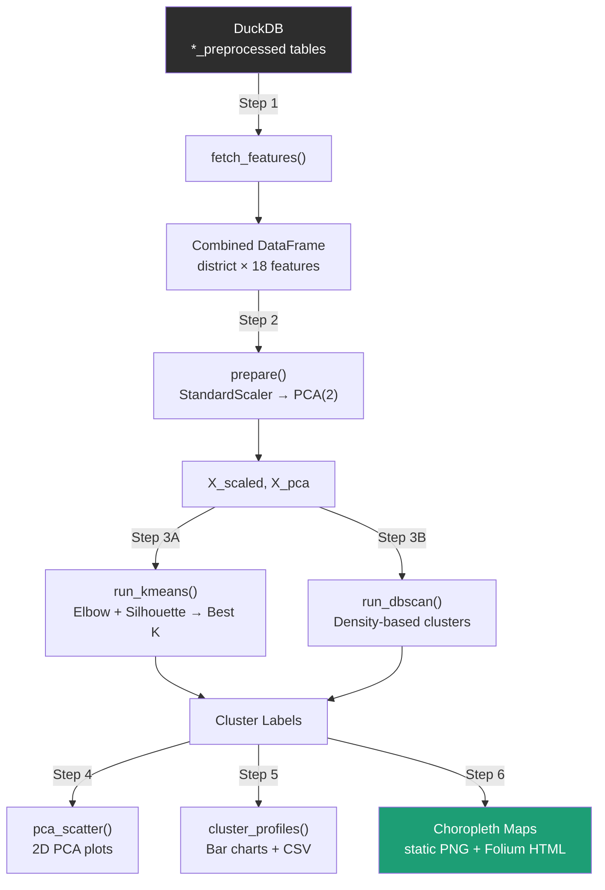

# `clustering.py` — Aadhaar District Clustering Pipeline

> Unsupervised clustering of Indian districts using Aadhaar biometric, demographic, and enrolment data. Produces scatter plots, cluster profiles, and interactive choropleth maps.

---

## Overview

`clustering.py` reads pre-processed Aadhaar tables from a **DuckDB** database, engineers district-level features across three data domains (biometric, demographic, enrolment), and applies two complementary clustering algorithms — **K-Means** and **DBSCAN**. Results are visualised as PCA scatter plots, bar-chart profiles, static PNG choropleths, and interactive Folium HTML maps.

All outputs are saved to a `clustering_output/` directory.

---

## Architecture



---

## Pipeline Steps

### Step 1 — Feature Extraction (`fetch_features`)

| Aspect | Detail |
|---|---|
| **Source** | Three DuckDB tables: `biometric_data_preprocessed`, `demographic_data_preprocessed`, `enrolment_data_preprocessed` |
| **Date filter** | Finds common dates across all three tables, then keeps only **month-start** dates (`YYYY-MM-01`) |
| **Aggregation** | `GROUP BY district, state` with `AVG()` on each feature column |
| **Join strategy** | Outer-merge on `(district, state)` across all three sources; missing values filled with `0` |

#### Feature Set (18 total)

| Prefix | Features | Count |
|---|---|---|
| `bio__` | `age_5_ratio`, `age_17_ratio`, `dependency_ratio`, `bio_total_7day_std`, `district_rank_in_state`, `daily_pct_change` | 6 |
| `demo__` | `demo_age_5_ratio`, `demo_age_17_ratio`, `demo_dependency_ratio`, `demo_total_7day_std`, `district_rank_in_state`, `daily_pct_change` | 6 |
| `enrol__` | `enrol_minor_ratio`, `enrol_adult_ratio`, `enrol_total_7day_std`, `district_rank_in_state`, `daily_pct_change` | 5 |
| | **Total** | **17** |


---

### Step 2 — Scaling & Dimensionality Reduction (`prepare`)

1. **Cleaning** — replaces `inf` / `NaN` values with `0`
2. **Standardisation** — `sklearn.preprocessing.StandardScaler` (zero mean, unit variance)
3. **PCA** — reduces to **2 components** for visualisation,prints explained variance

Returns both `X_scaled` (full-dimensional, for K-Means) and `X_pca` (2D, for DBSCAN and plots).

---

### Step 3A — K-Means Clustering (`run_kmeans`)

| Parameter | Value |
|---|---|
| K range explored | 2 – 10 |
| Selection metric | **Silhouette score** (automatic) or `--k` override |
| Random state | 42, `n_init=10` |

**Outputs:**

- `elbow_silhouette.png` — side-by-side **inertia elbow** and **silhouette score** plots to guide K selection
- Final cluster labels assigned with the best (or forced) K

---

### Step 3B — DBSCAN Clustering (`run_dbscan`)

| Parameter | Default | CLI flag |
|---|---|---|
| `eps` | 0.8 | `--eps` |
| `min_samples` | 5 | `--min` |

Runs on the **2D PCA** projection. Districts not assigned to any cluster are labelled as **noise** (`-1`).

---

### Step 4 — PCA Scatter Plots (`pca_scatter`)

Generates two scatter plots over the 2D PCA space:

| File | Colouring |
|---|---|
| `pca_kmeans.png` | K-Means cluster labels |
| `pca_dbscan.png` | DBSCAN cluster labels (noise in grey) |

Uses a curated 10-colour palette for visual distinction.

---

### Step 5 — Cluster Profiles & Summary (`cluster_profiles`, `save_summary`)

- **Bar chart** (`cluster_profiles_kmeans.png`) — grouped bars showing **mean feature values** per cluster for 7 key features:
  - Bio age-5 ratio, Bio dependency ratio, Bio growth %
  - Demo age-5 ratio, Minor ratio, Adult ratio, Enrol growth %
- **CSV** (`cluster_summary.csv`) — full district-level table with columns:
  `district, state, kmeans_cluster, dbscan_cluster, <all 17 features>`

---

### Step 6 — Choropleth Maps (`match_shp`, `static_map`, `folium_map`)

#### District Name Matching (`match_shp`)

Bridges the gap between database district names and shapefile district names:

1. **Manual mapping** — applies `DISTRICT_MAP` from `district_mapping.py` for known mismatches
2. **Fuzzy matching** — uses `rapidfuzz.fuzz.WRatio` with a threshold of **82** to handle remaining spelling variations
3. Prints match rate and lists unresolved districts

#### Static Maps (`static_map`)

- `kmeans_choropleth.png` / `dbscan_choropleth.png`
- Uses `geopandas.plot()` with a custom `ListedColormap`
- Unmatched districts rendered in light grey (`#ECECEC`)

#### Interactive Maps (`folium_map`)

- `kmeans_choropleth.html` / `dbscan_choropleth.html`
- Projected to **EPSG:4326** for web display
- **CartoDB positron** base tiles, centred on India `[22, 80]`
- Hover tooltips showing district name and cluster ID
- Inline HTML legend

---

## Usage

```bash
python clustering.py --db path/to/aadhaar.duckdb --shp path/to/india_districts.shp
```

### CLI Arguments

| Flag | Type | Required | Default | Description |
|---|---|---|---|---|
| `--db` | `str` | ✅ | — | Path to DuckDB database with `*_preprocessed` tables |
| `--shp` | `str` | ✅ | — | Path to India district shapefile (`.shp`) |
| `--k` | `int` | ❌ | Auto (silhouette) | Force a specific K for K-Means |
| `--eps` | `float` | ❌ | `0.8` | DBSCAN neighbourhood radius |
| `--min` | `int` | ❌ | `5` | DBSCAN minimum samples per core point |

---

## Output Files

| File | Description |
|---|---|
| `elbow_silhouette.png` | Elbow & silhouette plots — **look at this first** to validate K |
| `pca_kmeans.png` | PCA scatter coloured by K-Means clusters |
| `pca_dbscan.png` | PCA scatter coloured by DBSCAN clusters |
| `cluster_profiles_kmeans.png` | Grouped bar chart of mean feature values per cluster |
| `cluster_summary.csv` | District → cluster assignment table with all features |
| `kmeans_choropleth.png` | Static map of K-Means clusters |
| `kmeans_choropleth.html` | Interactive Folium map (K-Means) — open in browser |
| `dbscan_choropleth.png` | Static map of DBSCAN clusters |
| `dbscan_choropleth.html` | Interactive Folium map (DBSCAN) |

---

## Dependencies

```
duckdb
geopandas
matplotlib
numpy
pandas
folium
rapidfuzz
scikit-learn
```

Also requires a local module:
- **`district_mapping.py`** — exports `DISTRICT_MAP`, a `dict` mapping known database district names to their canonical shapefile equivalents.

---

## Key Design Decisions

| Decision | Rationale |
|---|---|
| **Two algorithms** (K-Means + DBSCAN) | K-Means gives clean, equal-ish partitions; DBSCAN highlights outlier/noise districts that don't fit any group |
| **PCA to 2D** | Enables visual inspection; DBSCAN also runs on 2D to avoid the curse of dimensionality |
| **Monthly dates only** | Smooths daily noise; aligns the three data sources on a common calendar |
| **Outer merge + fill 0** | Preserves all districts even if one source is missing data |
| **Fuzzy matching at 82** | Balances recall (catch spelling variants) vs precision (avoid false matches) |
| **Manual `DISTRICT_MAP` first** | Handles known mismatches that fuzzy matching cannot resolve reliably |
